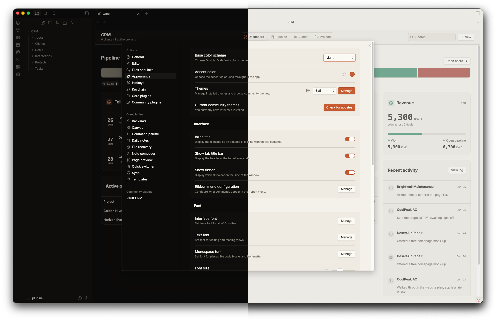
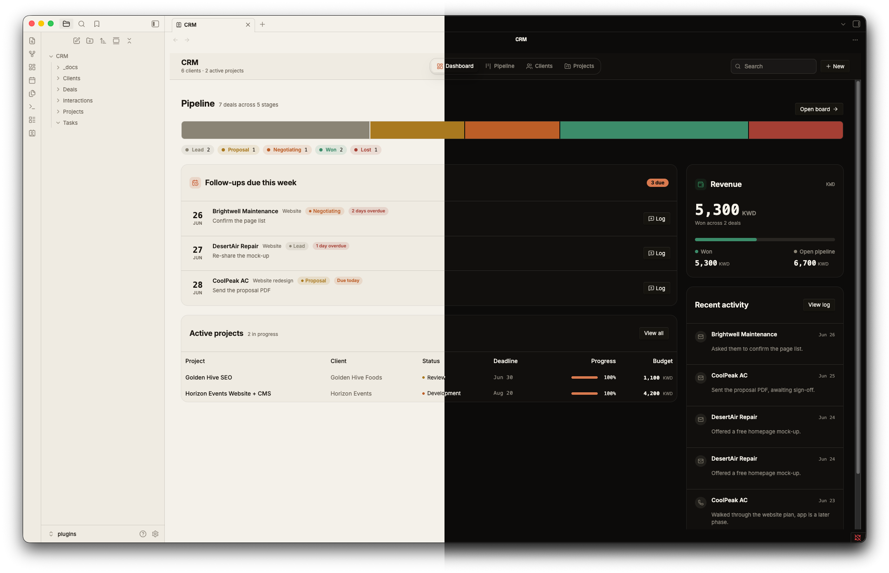

# Safi

A warm editorial Obsidian theme. Think workbench, not dashboard: a warm near-black (or warm paper) canvas, confident Space Grotesk headings, comfortable Inter body text, and one clay accent. Depth comes from hairline borders, never drop shadows.

Pulled from the brand at [abdulkadersafi.com](https://abdulkadersafi.com).

## Both modes

- **Dark** (the default): warm near-black canvas `#0c0b0a`, raised surfaces `#16140f`, warm white text `#f5f2ea`, clay accent `#d97a4f`.
- **Light** (warm paper): background `#f4f1ea`, raised surfaces `#fbf9f3`, near-black text `#1a1611`, deeper clay accent `#c75c33` so small text stays readable on paper.

Switch between them in Obsidian under Settings, Appearance, Base color scheme.

## What you get

- One clay accent across links, checkboxes, toggles, and buttons. No second accent hue.
- Space Grotesk for headings and the inline title, Inter for reading, JetBrains Mono for code and UI meta.
- H2 headings render in clay.
- Hairline borders for depth, a single committed corner radius, and body text that passes WCAG AA contrast.

## Fonts

The theme loads Space Grotesk, Inter, and JetBrains Mono from Google Fonts, so first paint needs an internet connection. After that they cache. If you want it fully offline, install the three fonts on your system and the theme will use them.

## Install

1. Copy the `Safi` folder into your vault at `.obsidian/themes/Safi`.
2. In Obsidian, open Settings, Appearance, Themes, and pick **Safi**.

## Customise

Colors and fonts live as CSS variables at the top of `theme.css`, grouped under `.theme-dark` and `.theme-light`. Edit those to retheme fast.

## Support

If this plugin is useful, you can support the work at [ko-fi.com/abdulkadersafi](https://ko-fi.com/abdulkadersafi).
